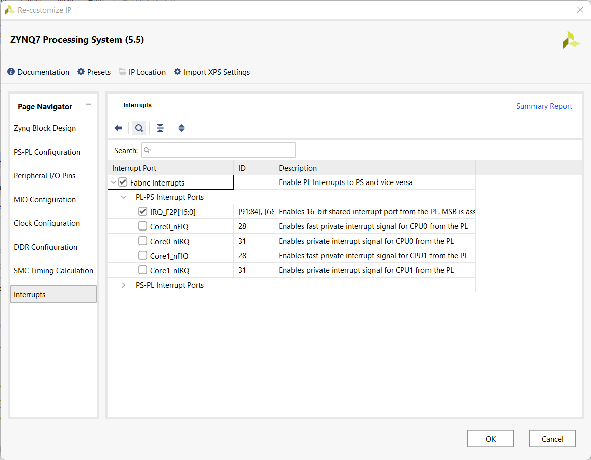
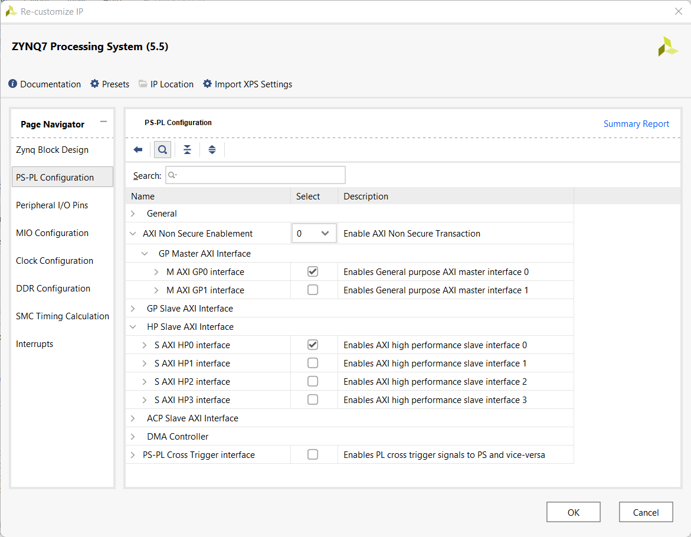
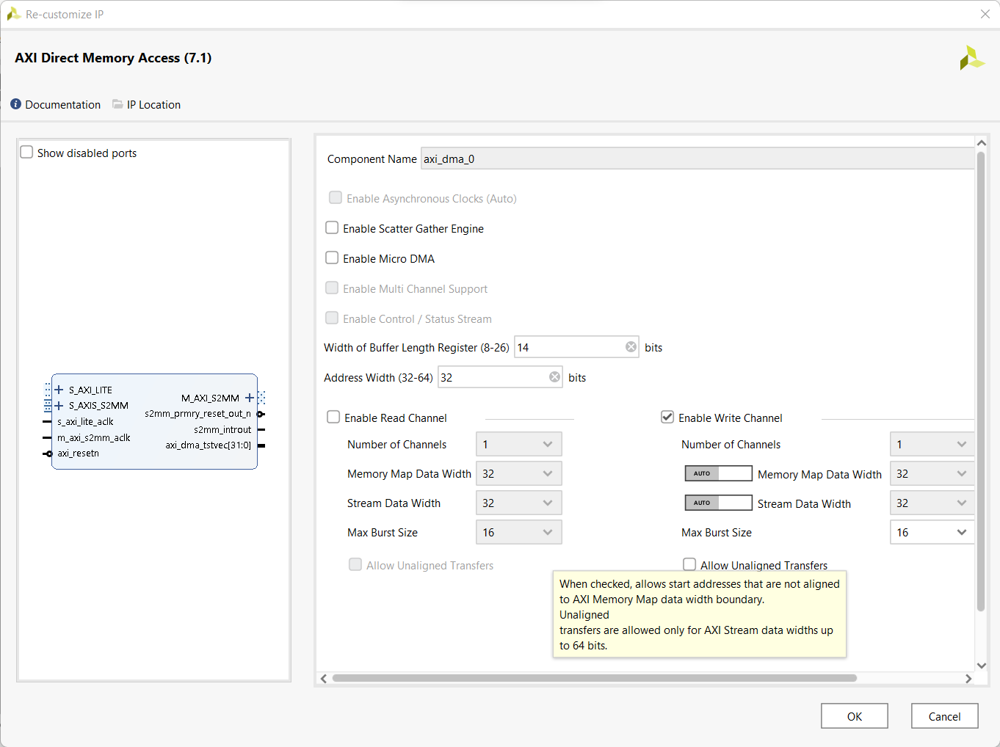
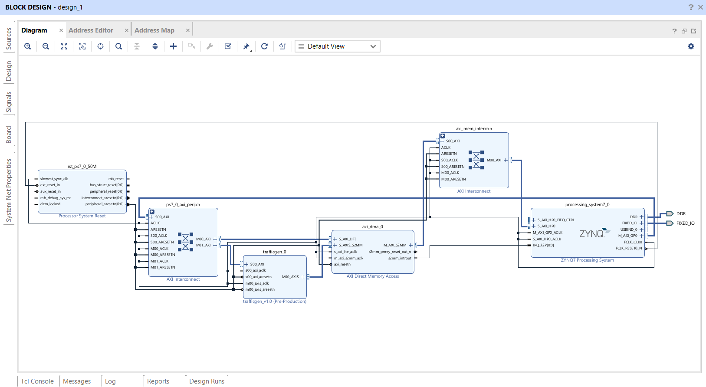
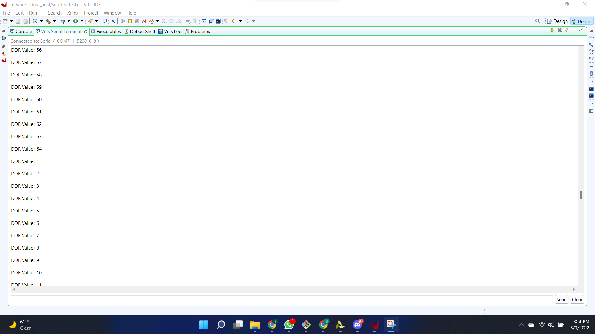

# ECE 520 Spring 2022
# Final Project
**California State University, Northridge**  
**Department of Electrical and Computer Engineering**  

**Report Created by:**
- Sri Siddharth Sunkavalli

# Direct Register Mode DMA and Writing to DDR Memory on Zybo

**Aim**: Moving data from traffic generator peripheral to DDR memory of Zybo Z7-10 using register mode DMA transactions

**Hardware components used**: 
* Digilent Zybo
* USB-A to Micro USB Cable

**Software application used**:
* AMD-Xilinx Vivado Design Suite

**Introduction**: Using the Traffic Generator IP to send data to the DDR memory of a Zybo Z7-10 board using direct memory access (DMA). There are two parts in the project; (i) hardware development, (ii) software development.

**Hardware Development**:
* Create a Vivado project and set the board part parameter to Zybo Z7-10.
* Add the Traffic Generator IP repo in Vivado.
* Insert the ZYNQ Processing System, enable fabric inputs and  enable the high-performance AXI slave interface
 
 
* Run Connection automation which connects the external interfaces DDR and Fixed IO.
* Add the AXI DMA IP and disable the Scatter Gather mode.
 
* Run Connection automation again to connect various interfaces.
* Insert the Traffic Generator and make necessary connections.
* Create HDL wrapper, Generate Bit Stream and export the Hardware.

**Block Design**:

 

**Software Development**:
* Create a Vitis platform project to create an application
* Select the hardware description file we previously exported.
* Create the Vitis application project where we write the driver to control the FPGA hardware and import the sources.
 

**Build and Run**
* Connect the Zybo to the host computer using USB-A to micro USB cable. 
* Connect to the serial console using any serial port communication program
* Build the project and then click Run As -> Launch on Hardware (Single Application Debug).

**Result**
* We notice the serial terminal being populated with numbers generated using the traffic generator.
* Notice that the counter runs from 1 to 64, rolls back to 1, and then restarts counting which is the expected behavior of the traffic generator we created.

**Video Demo** >> [Youtube_Demo](https://youtu.be/ptCrBE0KOc8)

**Conclusion**

We have successfully implemented and tested a register mode DMA communication transfer using the ZYNQ PS and the external DDR memory on the Zybo Z7-10 board.